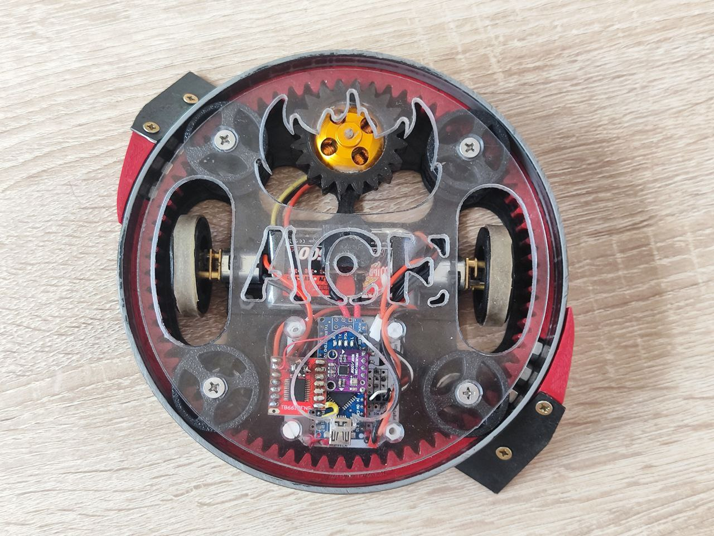
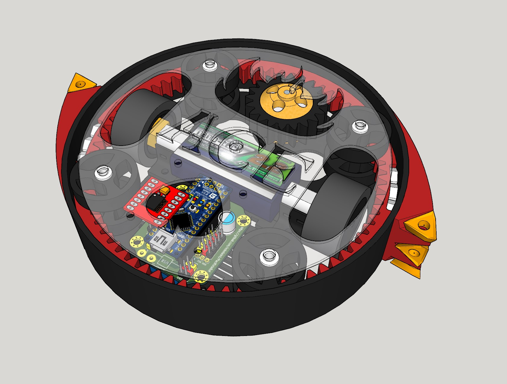

# AceBot

Robot de combate para la competición de la Oshwdem 2023 con arma actualizada y hardware revisado.

## Hardware
- Arduino Nano
- Driver de motores TB6612FNG
- 2x Motores "Pololu" N20 6V@500rpm
- LiPo 3S ~500 mAh
- Módulo bluetooth HC-05
- Giroscopio GY-91 MPU9250 BMP280
- chapa de metal a 45º recortada a medida
- Chasis impreso en PLA con sección de tubo de pvc

## Software
- Programado con Arduino IDE
- Usa el Giroscopio para mantenerse en posición cuando gira la parte exterior
- Controlado remotamente mediante bluetooth con el mando de [MiniFrankyBot](https://github.com/OPRobots/MiniFrankybot)
